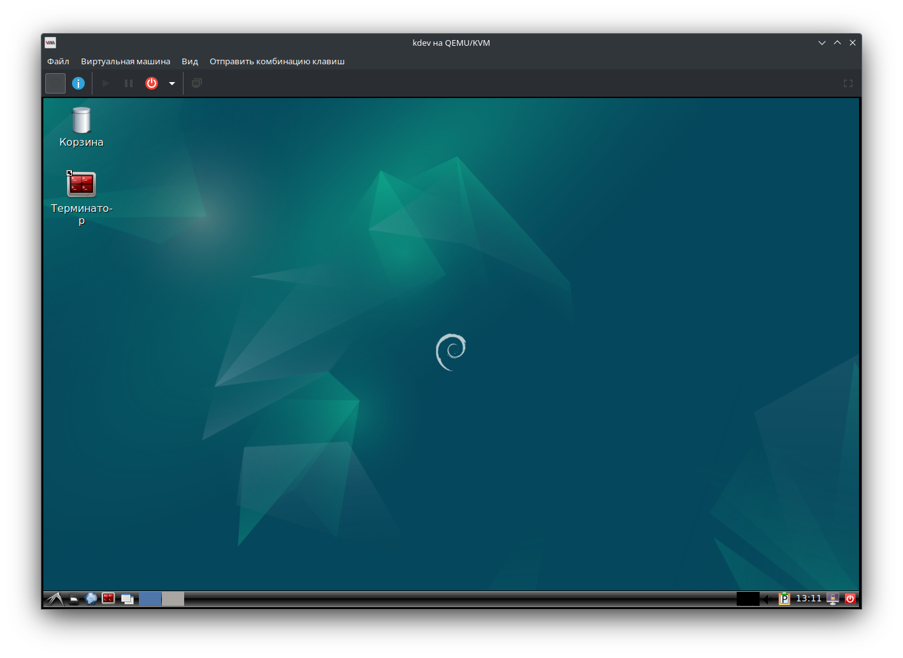
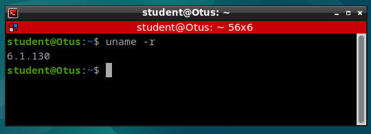
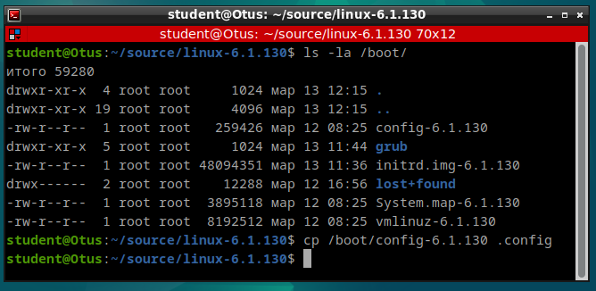
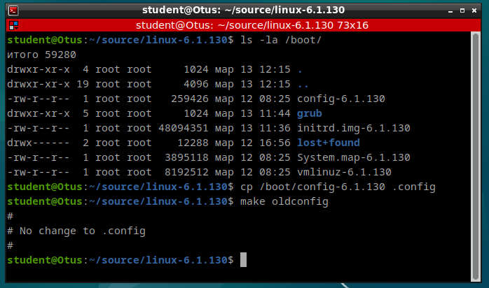
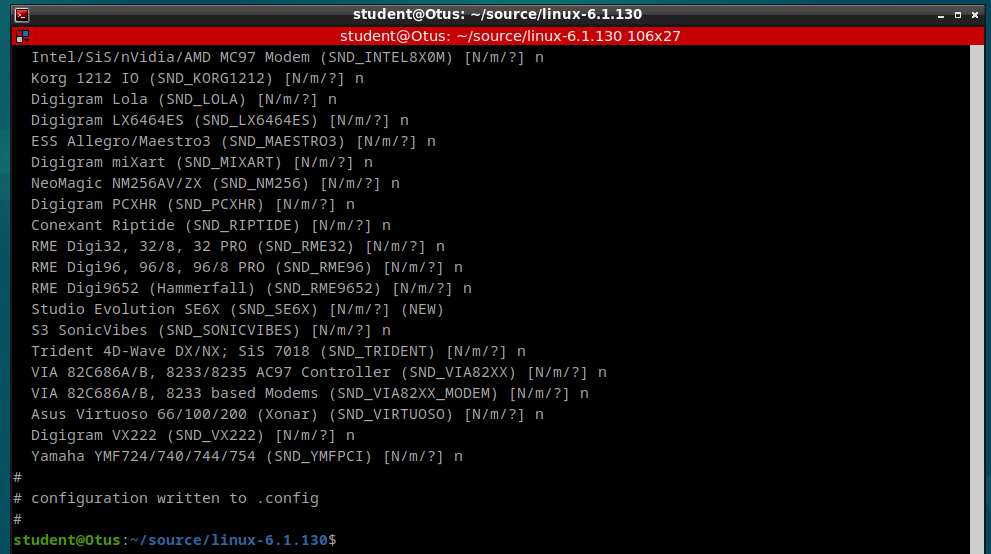
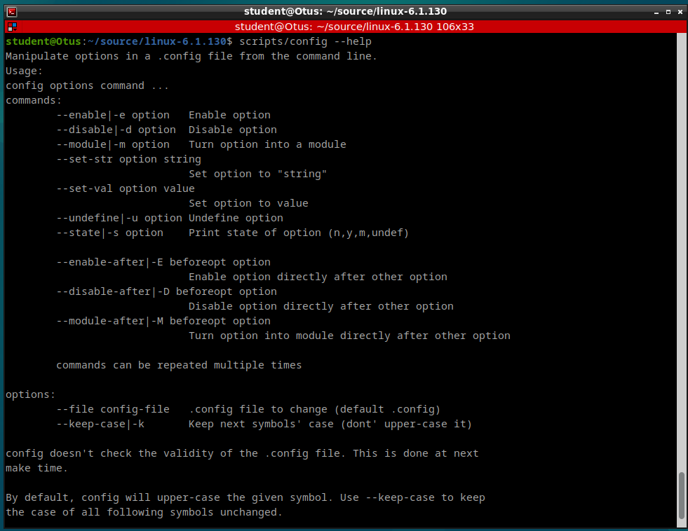
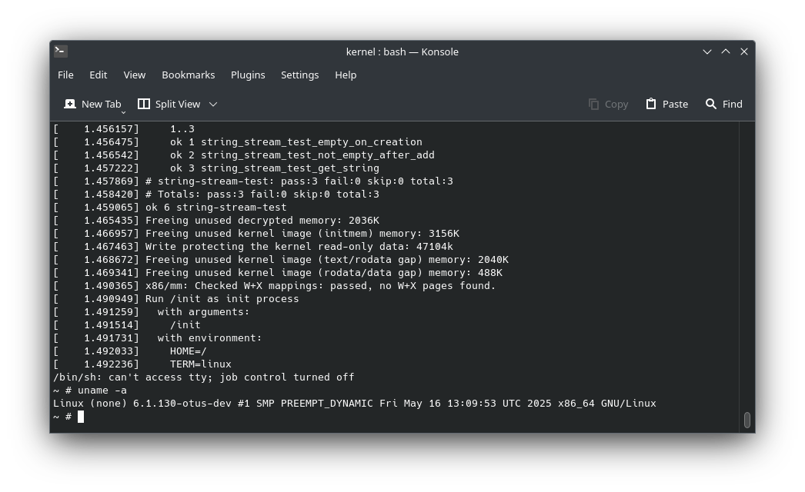
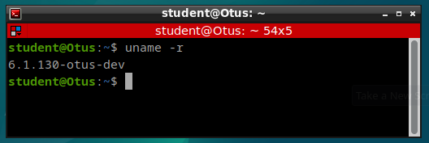

## Домашнее задание

Скомпилируйте собственную оптимизированную версию ядра на виртуальной машине

### Цель:

Скомпилировать и настроить оптимизированное ядро для дальнейшей работы

Описание/Пошаговая инструкция выполнения домашнего задания:

Пошаговая инструкция:

* Установить qemu-kvm, virt-manager
* Скачать debian 12 из нашего репозитория git
* Установить debian12 на виртуальную машину qemu-kvm.
* Клонировать ядро из нашего репозитория git
* Изменить .config файл, убрав лишние опции и добавив нужные опции для отладки. Список опций для дз будет в git репозитории
* Собрать .deb пакет ядра
* Установить .deb пакет ядра и проверить, что все работает

<br>

## Решение

### Файлы

#### Конфигурация

* config_from_vm - файл конфигурации из виртуальной машины.
* config - файл оптимизированной и настроенной конфигурации.
* config_from_deb - файл конфигурации из пакета deb.

#### Настройка и сборка

* Dockerfile - докер файл для контейнера сборки.
* set_config_param.sh - файл установки параметров конфигурации.

#### Ядро

* linux-libc-dev_6.1.130-otus-dev-1_amd64.deb
* linux-headers-6.1.130-otus-dev_6.1.130-otus-dev-1_amd64.deb
* linux-image-6.1.130-otus-dev_6.1.130-otus-dev-1_amd64.deb

#### Дополнительно

* initramfs - каталог с ramfs.

<br>
<br>

### Шаг 1

В соответствии с заданием и [инструкцией](https://github.com/OTUS-Linux-kernel-dev/Linux-kernel-dev/blob/main/doc/module_1/0x04_QA.md) загружен и развернут образ виртуальной машины.



Проверил версию установленного ядра, установлено ядро 6.1.130




### Шаг 2

Загрузил и распаковал исходники ядра 6.1.130

``` bash
mkdir source
cd source
wget https://cdn.kernel.org/pub/linux/kernel/v6.x/linux-6.1.130.tar.gz
tar xvf linux-6.1.130.tar.gz
cd linux-6.1.130
```

### Шаг 3

Сделал копию конфигурации текущего ядра
``` bash
cp /boot/config-6.1.130 .config
```



Полученную конфигурацию необходимо актуализировать до состояния текущего ядра.
Выполнил команду:
``` bash
make oldconfig
```




Оптимизировал конфигурацию.
Выполнил команду:
``` bash
make localmodconfig
```


### Шаг 4

С помощью утилиты **config** для установки опций конфигурации ядра, расположенной в папке **scripts**  исходного кода ядра, установил дополнительные опции и отключил ненужные.

Для автоматизации установки и отключения опций написал скрипт [set_config_param.sh](./set_config_param.sh) 

Справка утилиты **config**


### Шаг 5

Для сборки ядра использовал Docker. За основу построения контейнера использовал проект [kernel-build-containers](https://github.com/a13xp0p0v/kernel-build-containers), перевел его на debian 12, минимизировал и дополнил необходимыми пакетами.

Сборка ядра

``` bash
fakeroot make bindeb-pkg -j $(nproc) 2>error.log
```


### Шаг 6

Собрал **busybox** и **initramfs**.
Проверил запуск и работоспособность ядра

```bash
qemu-system-x86_64 -m 2G -enable-kvm  -kernel bzImage -nographic -append "earlyprintk=serial,ttyS0 console=ttyS0 debug" --initrd custom-initramfs.cpio.gz
```


### Шаг 7

Установка ядра

``` bash
dpkg -i linux-libc-dev_6.1.130-otus-dev-1_amd64.deb
dpkg -i linux-image-6.1.130-otus-dev_6.1.130-otus-dev-1_amd64.deb
```
Перезагрузился с новым ядром


